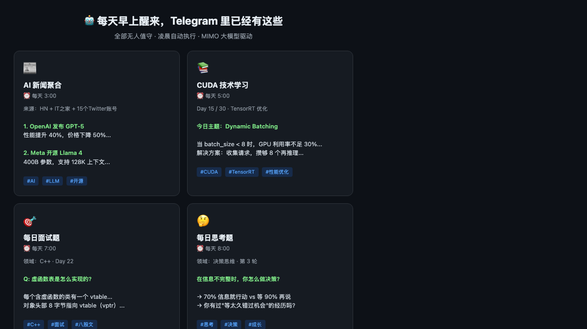

<div align="center">


# Hermes Daily Automation

**个人 AI 晨间操作系统** — 新闻、学习、面试、GitHub 摘要、深夜复盘写回记忆。  
基于 [Hermes Agent](https://github.com/NousResearch/hermes-agent) 的 **Progressive Cron（内容递进）** 模板包，可用 MIMO / DeepSeek / OpenAI / Claude 等。

[](LICENSE)
[](https://github.com/NousResearch/hermes-agent)
[](CONTRIBUTING.md)

*AI 不该只是你问它答，而该是会自己上班的数字员工。*

**简体中文** · [English](README.md)

[5 分钟 Demo](#-5-分钟-demo) · [Skills](#-安装-skills-agentskillsio) · [Packs](#-packs-场景包) · [样例](#-效果与样例) · [Progressive Cron](#-progressive-cron-内容递进) · [模板](#-模板列表) · [成本](#-成本说明)

</div>

---

## 为什么做这个

Hermes 已有 Cron / Memory / Skills。多数人缺的是一套**开箱即用的个人 OS**：默认路径、防重复课程机制、可对照的样例输出。

| 你得到的 | 不是 |
|----------|------|
| 可安装的每日任务 + `~/.hermes/daily/` 默认目录 | 又一个 Agent 框架 |
| **Progressive Cron**（计划 + 历史 + 第几天） | 每天重复 Day 1 的无状态 prompt |
| 有终点的课程 **跑完自己 pause** | 计划结束后的僵尸任务 |
| 中英模板 | 只有中文或只有英文 README |

---

## ⚡ 5 分钟 Demo

**前置：** 已安装 [Hermes Agent](https://github.com/NousResearch/hermes-agent)，配好模型与消息渠道（Telegram 等）。

```bash
git clone https://github.com/schbxg/hermes-daily-automation.git
cd hermes-daily-automation

chmod +x scripts/install-demo.sh
./scripts/install-demo.sh
# 英文 prompt：HERMES_DAILY_LANG=en ./scripts/install-demo.sh
# 非交互直接建 cron：HERMES_DAILY_CREATE_CRON=yes ./scripts/install-demo.sh

hermes cron list
hermes cron run <job_id>
```

消息里应收到一条 AI 新闻摘要。格式参考：[`examples/ai-news-sample.md`](examples/ai-news-sample.md)。

若尚未有 Hermes 配置：

```bash
cp config-template.yaml ~/.hermes/config.yaml
# 再执行 hermes setup / hermes model / hermes gateway
```

一键非交互（建数据 + cron + skills）：

```bash
HERMES_DAILY_CREATE_CRON=yes HERMES_DAILY_INSTALL_SKILLS=yes ./scripts/install-demo.sh
```

---

## 🧩 安装 Skills（agentskills.io）

带 YAML frontmatter 的可移植 Skill，可被 Hermes 及其它兼容运行时加载：

| Skill | 作用 |
|-------|------|
| [`content-progression`](skills/content-progression/SKILL.md) | Progressive Cron 防重复协议 |
| [`daily-self-review`](skills/daily-self-review/SKILL.md) | 深夜人会话复盘 |
| [`github-morning-digest`](skills/github-morning-digest/SKILL.md) | `gh` 早间分拣 |

```bash
./scripts/install-skills.sh
# 开发时用软链：
HERMES_SKILLS_LINK=1 ./scripts/install-skills.sh

hermes skills list
```

默认安装到 `~/.hermes/skills/productivity/<skill-name>/`。详见 [`skills/README.md`](skills/README.md)。

---

## 📸 效果与样例

<div align="center">



*产品总览示意图。具体文案形态请看下方 markdown 样例。*

</div>

| 样例 | 内容 |
|------|------|
| [AI 新闻](examples/ai-news-sample.md) | 国际/国内要点 + 点评 |
| [面试题](examples/interview-sample.md) | 题 + 答 + 追问 |
| [技术学习](examples/learning-sample.md) | Day N 课程卡片 |
| [GitHub 日报](examples/github-digest-sample.md) | Needs you / PR / 30 分钟焦点 |
| [每日复盘](examples/daily-review-sample.md) | ≤300 字夜复盘 |
| [思考题](examples/thinking-sample.md) | 开放问题 + 角度 |

更多见 [`examples/README.md`](examples/README.md)。欢迎 PR 真实 Telegram 截图（打码）到 `screenshots/`。

---

## 🧠 Progressive Cron（内容递进）

**核心机制命名：** 用文件系统做 Agent 的跨 session 外部记忆。

```text
计划 plan.md  →  每日 cron  →  history/ 追加
                   │
        1. 算今天是第 N 天
        2. 读计划第 N 行
        3. 读最近 3 份 history
        4. 生成不重复内容
        5. 写入 day_NN.md
        6. 超出计划 → pause(自己)
```

**可引用长文：** [`docs/progressive-cron.zh-CN.md`](docs/progressive-cron.zh-CN.md) · [English](docs/progressive-cron.md)  
**可安装 Skill：** [`skills/content-progression/SKILL.md`](skills/content-progression/SKILL.md)

**可单独拿走的部分：** 不必用整包，只把 Progressive Cron 嵌进任意定时任务即可。

---

## 🎁 Packs（场景包）

| Pack | 适合 |
|------|------|
| [Morning Brief](packs/morning-brief/README.md) | 工作日：新闻 + GitHub |
| [Learning OS](packs/learning-os/README.md) | 课程 + 面试 + 夜复盘 |

见 [`packs/README.md`](packs/README.md)。

---

## 📦 模板列表

每个任务均有中文版 + [`cron-jobs/en/`](cron-jobs/en/) 英文版。

### 信息聚合

| 模板 | 说明 | 建议时间 |
|------|------|----------|
| [AI 新闻](cron-jobs/ai-news.md) · [EN](cron-jobs/en/ai-news.md) | 网页检索 + 可选 X RSS | 03:00–08:00 |
| [GitHub 日报](cron-jobs/github-digest.md) · [EN](cron-jobs/en/github-digest.md) | PR/CI/通知（需 `gh`） | 08:00 |
| [推文草稿](cron-jobs/tweet-draft.md) · [EN](cron-jobs/en/tweet-draft.md) | 2–3 条草稿，人工再发 | 09:00 |

### 学习

| 模板 | 说明 | 建议时间 |
|------|------|----------|
| [技术学习](cron-jobs/learning.md) · [EN](cron-jobs/en/learning.md) | 计划驱动 + 历史防重 | 05:00 |
| [英语](cron-jobs/english.md) · [EN](cron-jobs/en/english.md) | 词汇听力 + TTS | 07:30 |
| [面试题](cron-jobs/interview.md) · [EN](cron-jobs/en/interview.md) | 每日一题 | 07:00 |
| [代码阅读](cron-jobs/code-reading.md) · [EN](cron-jobs/en/code-reading.md) | N 天啃大文件 → 自 pause | 20:00 |
| [专题速成](cron-jobs/topic-study.md) · [EN](cron-jobs/en/topic-study.md) | N 天专题 + 真实代码 | 21:00 |

### 自我进化

| 模板 | 说明 | 建议时间 |
|------|------|----------|
| [每日复盘（做梦）](cron-jobs/daily-review.md) · [EN](cron-jobs/en/daily-review.md) | 只看人的会话 → MEMORY | 03:00 |

### 生活

| 模板 | 说明 | 建议时间 |
|------|------|----------|
| [思考题](cron-jobs/thinking.md) · [EN](cron-jobs/en/thinking.md) | 7 领域轮换 | 08:00 |
| [理财](cron-jobs/finance.md) · [EN](cron-jobs/en/finance.md) | 30 天入门（教育向） | 21:00 |

### 构件

| 路径 | 作用 |
|------|------|
| [`prompt-templates/`](prompt-templates/) | 可复制 Prompt |
| [`skills/`](skills/README.md) | agentskills.io 包 |
| [`packs/`](packs/README.md) | 场景包 |
| [`docs/progressive-cron.zh-CN.md`](docs/progressive-cron.zh-CN.md) | 可引用机制文 |
| [`AGENTS-template.md`](AGENTS-template.md) | 项目级 Agent onboarding |
| [`data/`](data/) | 安装脚本示例计划 |

---

## 架构关系

```text
Hermes Agent（运行时：Cron / Memory / Skills / 消息）
        │
        ▼
~/.hermes/daily/   ← 本包装填的状态根目录
  plan.md · history/ · MEMORY.md
        │
        ▼
Telegram / Discord / Slack / …
```

### 最佳实践

1. **时间打散**，别 10 个任务全挤 3 点  
2. 课程类任务必须 **读历史 → 写历史**  
3. 真实项目放 `AGENTS.md`，学习任务才能贴你的代码  
4. 控制推送长度，方便手机阅读  

---

## 💰 成本说明

短摘要类任务在 DeepSeek / MIMO 量级 API 上，常见是：

| 负载 | 量级 |
|------|------|
| 每天 1 条 AI 新闻 | 往往 **远低于 $0.01–0.05/天** |
| 8–10 个任务全开 | 多数情况是 **每天几分钱级**（请用你的账单核实） |

代码精读、大量抓取更贵——先跑通 **一个** demo 任务。

---

## 常见问题

**会不会每天重复？**  
按 Progressive Cron（计划 + 历史 + 第几天）设计就不会。详见 Skill 文档。

**能否不用 Telegram？**  
可以，Hermes 网关支持多平台。

**调试**

```bash
hermes cron run <job_id>
hermes logs --follow
hermes cron pause <job_id>
```

**自定义数据目录**

```bash
export HERMES_DAILY_HOME=/path/to/daily
./scripts/install-demo.sh
```

---

## 贡献

欢迎新模板、英文翻译、打码截图、样例输出。见 [CONTRIBUTING.md](CONTRIBUTING.md)。

---

## 致谢

- [Hermes Agent](https://github.com/NousResearch/hermes-agent) / [Nous Research](https://nousresearch.com)
- 以及让「每天跑 Agent」成本可接受的各家模型

---

<div align="center">

**若这套模板帮你省下从零拼 prompt 的晚上，欢迎点 ⭐，让更多人搜到能跑通的包。**

</div>
